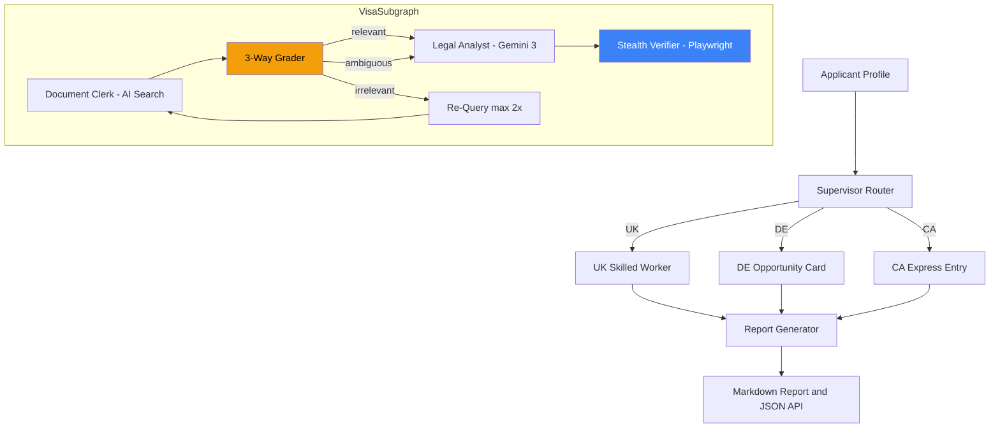

# 🌍 Global Mobility Application Analyzer

> **Multi-agent visa eligibility assessment system** — Corrective RAG with live government portal verification, built for architectural rigor.


---

## The Problem

An Indian software engineer exploring the UK Skilled Worker Visa faces 200+ pages of fragmented legal text, contradictory salary thresholds (changed 3 times since 2024), and $3,000–$8,000 in legal consultation fees — for a basic eligibility check.

This is a retrieval and synthesis problem. This system solves it with Agentic RAG.

---

## Architecture



---

## Why This Is Senior-Grade

This is not a LangChain tutorial project. It demonstrates enterprise AI architecture decisions:

### 1. Corrective RAG, Not Naive RAG
A simple RAG pipeline retrieves chunks and passes them to an LLM. This system adds a **3-way Grader** that classifies retrieval quality as `relevant`, `irrelevant`, or `ambiguous`. Irrelevant results trigger re-query. Ambiguous results — where retrieved documents *contradict each other* — are forwarded to the Legal Analyst with explicit conflict resolution instructions: resolve by recency, then by source authority.

**Why it matters**: Immigration law contains contradictory documents. The UK salary threshold changed from £38,700 to £41,700. Both values exist in government archives. A naive RAG system uses whichever chunk the embedding model happens to surface. This system detects the contradiction.

→ [ADR-002: Corrective RAG](docs/adr/ADR-002-Corrective-RAG.md)

### 2. Live Verification Layer
The RAG knowledge base may be stale. A Stealth Verification Node (Playwright with anti-bot-detection) checks live government portals for volatile data: CRS cutoffs (change every 2 weeks), salary thresholds (changed March 2026), degree recognition status.

**Why stealth?** Government portals use Cloudflare, AWS WAF, and JavaScript rendering. Standard HTTP requests return CAPTCHA pages, not data. There are no public APIs. 

→ [ADR-003: Stealth Verification](docs/adr/ADR-003-Stealth-Verification.md)

### 3. Observability & Cost Control
Every LangGraph node is traced via LangSmith. A custom `TokenTracker` records input/output tokens per node, per run. On free-tier APIs (Gemini + Azure), this is not optional — it prevents surprise rate limits and enables cost projection at scale.

### 4. Modular Subgraph Architecture
Each visa category is an isolated, compiled LangGraph subgraph. Adding a new visa = adding one file. Zero changes to existing workflows. Independently testable and evaluable.

→ [ADR-001: Modular Subgraphs](docs/adr/ADR-001-Modular-Subgraphs.md)

---

## Sprint 1 Visa Workflows

### 🇬🇧 UK Skilled Worker Visa
Points-based, employer-sponsored. Exercises SOL lookup, salary threshold validation, monthly compliance check (March 26, 2026 rule).

**2026 Constants**: £41,700 threshold | £17.13/hr floor | Monthly salary checks

### 🇩🇪 Germany Opportunity Card (Chancenkarte)
Self-sponsored, qualification-based. Exercises foreign credential recognition (Anabin), different scoring algorithm with IT/Healthcare shortage bonus.

**2026 Constants**: €13,092/yr financial proof | +1 point for IT & Healthcare

### 🇨🇦 Canada Express Entry (Federal Skilled Worker)
Fully points-based (most complex scoring). Exercises CRS ranking, NOC classification, language benchmark mapping.

**2026 Constants**: Draw #402 Senior Managers CRS 429 | General CEC ~508

---

## Tech Stack

| Layer | Technology | Purpose |
|---|---|---|
| Orchestration | LangGraph | Multi-agent state machine with compiled subgraphs |
| LLM | Google Gemini 3 | Legal analysis, grading, eligibility assessment |
| Retrieval | Azure AI Search | Hybrid semantic + keyword search over immigration law |
| Verification | Playwright | Stealth browser checks on live government portals |
| Tracing | LangSmith | Full node-level tracing with token accounting |
| API | FastAPI | REST API with Pydantic validation |
| Cache | SQLite | Local response/verification caching (free-tier cost savings) |
| Frontend | Dark glassmorphism dashboard | Bloomberg Terminal-style analytical UI |

---

## Getting Started

### Prerequisites
- Python 3.9+
- [Google AI Studio API key](https://aistudio.google.com/apikey) (free tier)
- [Azure free account](https://azure.microsoft.com/free/) with AI Search service
- [LangSmith account](https://smith.langchain.com/) (free tier — 5K traces/month)

### Setup

```bash
git clone https://github.com/yourusername/global-mobility-analyzer.git
cd global-mobility-analyzer

# Install dependencies
pip install -e ".[dev]"

# Configure environment
cp .env.example .env
# Edit .env with your API keys

# Install Playwright browsers
playwright install chromium

# Verify installation
python3 -c "from src.shared.state import GraphState, GraderOutput; print('✅ State models OK')"
python3 -c "from src.agents.verifier import VERIFICATION_TARGETS; print(f'✅ {len(VERIFICATION_TARGETS)} verification targets OK')"
```

---

## Project Structure

```
src/
├── shared/
│   └── state.py              # Pydantic state schema (GraphState, GraderOutput, etc.)
├── agents/
│   ├── supervisor.py          # LangGraph router
│   ├── document_clerk.py      # Azure AI Search retriever + ingestion
│   ├── legal_analyst.py       # Gemini 3 eligibility evaluator
│   ├── grader.py              # 3-way relevance grader (CRAG loop)
│   ├── verifier.py            # Stealth browser verification (2026 constants)
│   └── report_generator.py    # JSON → Markdown
└── workflows/
    ├── uk_skilled_worker.py    # UK subgraph
    ├── de_opportunity_card.py  # Germany subgraph
    └── ca_express_entry.py     # Canada subgraph

docs/
├── PRD.md                     # Product requirements
├── System_Design.md           # Architecture deep-dive + sequence diagrams
├── Roadmap.md                 # 3-sprint implementation plan
└── adr/
    ├── ADR-001-Modular-Subgraphs.md
    ├── ADR-002-Corrective-RAG.md
    └── ADR-003-Stealth-Verification.md
```

---

## Documentation

| Document | Purpose |
|---|---|
| [PRD](docs/PRD.md) | Problem statement, personas, success metrics |
| [System Design](docs/System_Design.md) | Sequence diagrams, grader logic, data flow |
| [Roadmap](docs/Roadmap.md) | Sprint plan with deliverables and exit criteria |
| [ADR-001](docs/adr/ADR-001-Modular-Subgraphs.md) | Why modular subgraphs over monolithic pipeline |
| [ADR-002](docs/adr/ADR-002-Corrective-RAG.md) | Why Corrective RAG for legal compliance |
| [ADR-003](docs/adr/ADR-003-Stealth-Verification.md) | Why stealth browser for government portals |

---

## Security

- **Zero-Trust**: No hardcoded API keys — `.env` + Azure Identity
- **PII Scrubbing**: Sensitive data masked before LLM calls
- **Audit Trail**: Every recommendation cites source URL + chunk ID
- **Cache Isolation**: Verification cache is local-only, auto-expires 24h

---

## License

MIT License — see [LICENSE](LICENSE) for details.
