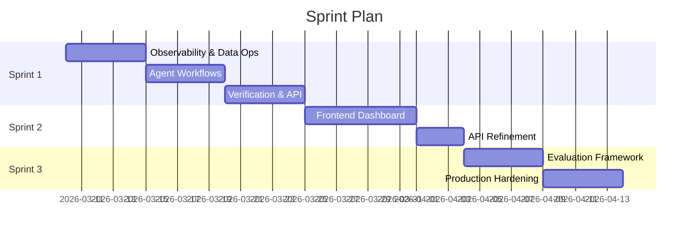

# Implementation Roadmap

**Project**: Global Mobility Application Analyzer | **Start Date**: 2026-03-07

---

## Sprint 1: Core Engine + Workflows (Weeks 1–3)

**Goal**: End-to-end eligibility assessment for 3 visa categories with observability.

### Phase A: Observability & Data Pipeline (Week 1)
| Task | Deliverable | Acceptance Criteria |
|---|---|---|
| LangSmith integration | `src/shared/observability.py` | Test trace visible in LangSmith dashboard |
| Custom TokenTracker | `TokenUsage` in `GraphState` | Token count logged per node per run |
| Azure AI Search index | Index schema for 3 countries | Hybrid search returns results for test query |
| Document ingestion | `src/data/ingestion.py` | 5 gov.uk PDFs chunked and indexed |
| Embedding pipeline | Embedding model selected + integrated | Chunks embedded and searchable |

### Phase B: Agent Workflows (Week 2)
| Task | Deliverable | Acceptance Criteria |
|---|---|---|
| Gemini 3 integration | `legal_analyst.py` connected | Structured JSON output for test profile |
| 3-way Grader with LLM | `grader.py` conflict detection | Correctly flags known contradictory test chunks |
| UK Skilled Worker subgraph | Full compiled subgraph | End-to-end: profile → report with citations |
| DE Opportunity Card subgraph | Full compiled subgraph | Points grid calculated, Anabin check |
| CA Express Entry subgraph | Full compiled subgraph | CRS estimate vs. Draw #402 cutoff |

### Phase C: Verification & Caching (Week 3)
| Task | Deliverable | Acceptance Criteria |
|---|---|---|
| Playwright stealth integration | `verifier.py` browser automation | Successfully scrapes gov.uk salary table |
| SQLite cache layer | Query + verification caching | Cache hit returns in <50ms, expires after 24h |
| FastAPI endpoints | `/assess` POST, `/health` GET | Profile submission returns JSON + Markdown |

**Sprint 1 Exit Criteria**: A user can POST an applicant profile, select UK/DE/CA, and receive a cited eligibility report within 30 seconds. LangSmith trace visible for every run.

---

## Sprint 2: Analytical Dashboard (Weeks 4–5)

**Goal**: Bloomberg-style frontend that transforms the API into a visual portfolio showcase.

### Phase D: Frontend Build
| Task | Deliverable | Acceptance Criteria |
|---|---|---|
| Design system setup | CSS tokens, dark glassmorphism, fonts | Consistent visual language across components |
| Applicant input panel | Multi-step form with validation | All `ApplicantProfile` fields captured |
| Eligibility report viewer | Markdown render + expandable citations | Points breakdown table, risk highlights |
| Metrics sidebar | Token cost, verification status, latency | Live data from `GraphState` metadata |
| LangSmith trace embed | Clickable trace link per assessment | Opens LangSmith trace in new tab |

### Phase E: API Refinement
| Task | Deliverable | Acceptance Criteria |
|---|---|---|
| WebSocket streaming | Real-time node progress updates | Dashboard shows "Grading..." → "Analyzing..." |
| Error handling UI | Graceful degradation for API failures | User-friendly error states, not stack traces |
| Responsive layout | Mobile-friendly dashboard | Usable on tablet/phone for demo purposes |

**Sprint 2 Exit Criteria**: A recruiter can visit the live URL, submit a test profile, and see a Bloomberg-style assessment with real-time progress indicators.

---

## Sprint 3: Evaluation & Hardening (Weeks 6–7)

**Goal**: Prove quality with data. Build confidence that the system works reliably.

### Phase F: Evaluation Framework
| Task | Deliverable | Acceptance Criteria |
|---|---|---|
| Eval dataset creation | 15 test cases (5 per visa) | Covers eligible, ineligible, edge cases |
| Behavioral contracts | Invariant tests in `pytest` | "must cite ≥1 source", "must return valid JSON" |
| Adversarial testing | 5 adversarial cases | Invalid profiles, contradictory docs handled gracefully |
| Statistical testing | 3-run evaluation per case | Consistency score ≥ 80% across runs |
| Quality dashboard | Metrics report (accuracy, citation coverage) | Published to `docs/eval_results.md` |

### Phase G: Production Hardening
| Task | Deliverable | Acceptance Criteria |
|---|---|---|
| CI/CD pipeline | GitHub Actions: lint, test, type-check | PR checks pass on every push |
| Docker compose | `docker-compose.yml` for local demo | `docker compose up` starts full stack |
| Security audit | PII scrubbing verification | No raw passport/salary data in LangSmith traces |
| Documentation polish | Complete Authority Pack | PRD, ADRs, System Design reviewed and final |

**Sprint 3 Exit Criteria**: The project passes all behavioral contracts, has documented eval results, and runs with a single `docker compose up`.

---

## Timeline Summary

