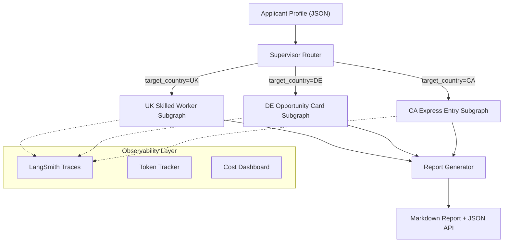
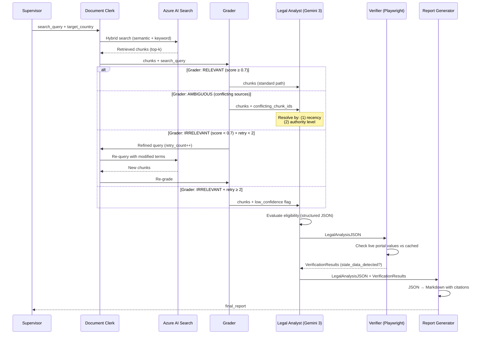

# System Design Specification — Global Mobility Application Analyzer

**Version**: 1.0 | **Date**: 2026-03-07

---

## Architecture Overview



---

## Corrective RAG Loop — Sequence Diagram

This is the core of every visa subgraph. The 3-way Grader ensures retrieval quality before the Legal Analyst synthesizes its assessment.



---

## 3-Way Grader — Ambiguity Handling Logic

### Classification Rules

```python
class GraderOutput(BaseModel):
    relevance: Literal["relevant", "irrelevant", "ambiguous"]
    score: float          # 0.0–1.0 confidence
    conflicting_chunks: list[str]  # populated when "ambiguous"
    reasoning: str
```

### Decision Matrix

| Condition | Classification | Next Node | Behavior |
|---|---|---|---|
| All chunks directly answer query, score ≥ 0.7 | `relevant` | Legal Analyst | Standard assessment |
| Chunks off-topic, score < 0.7, retry < 2 | `irrelevant` | Re-Query | Refine search terms, re-retrieve |
| Chunks off-topic, score < 0.7, retry ≥ 2 | `irrelevant` | Legal Analyst | Low-confidence flag set |
| Chunks relevant but contradictory | `ambiguous` | Legal Analyst | `conflicting_chunks` forwarded |

### Conflict Resolution Protocol

When the Legal Analyst receives `ambiguous` grading with `conflicting_chunks`:

1. **Recency**: Compare `published_date` of conflicting chunks. Most recent wins.
2. **Authority**: If dates are identical, rank by `authority_level`:
   - `primary_legislation` (Acts of Parliament, Federal statutes)
   - `regulation` (Statutory instruments, orders-in-council)
   - `guidance` (Government guidance documents, policy notes)
   - `commentary` (Law firm blogs, news articles)
3. **Transparency**: Output must include `ambiguity_resolution` field explaining which source was chosen and why.

---

## State Schema

```python
class GraphState(TypedDict, total=False):
    # Input
    applicant_profile: ApplicantProfile
    target_country: TargetCountry        # "UK" | "DE" | "CA"

    # Retrieval
    retrieved_chunks: List[DocumentChunk]
    search_query: str
    original_query: str

    # Grading (Decision #6)
    grader_output: GraderOutput
    retry_count: int                     # max 2

    # Analysis
    legal_analysis: LegalAnalysisJSON

    # Verification (Decision #7)
    verification_results: List[VerificationResult]

    # Output
    final_report: str                    # Markdown
    citations: List[Citation]            # Audit trail

    # Observability (Decision #8)
    token_usage: List[TokenUsage]        # Per-node tracking
```

---

## Data Flow — Per Visa Workshop

### UK Skilled Worker

```
ApplicantProfile → generate query →
  "UK Skilled Worker visa eligibility for {job_title} at £{salary}"
→ Azure AI Search (index: uk-immigration)
→ Grader evaluates:
    - Is the SOL entry current?
    - Does the salary threshold match 2026 rules?
    - Are there conflicting immigration rules?
→ Legal Analyst:
    - Mandatory 50 points check (sponsorship, skill level, English)
    - Tradeable points (salary, PhD, SOL)
    - Salary compliance: monthly check per 2026-03-26 rule
→ Verifier: live check gov.uk salary tables
→ Report Generator: Markdown with points breakdown table
```

### DE Opportunity Card

```
ApplicantProfile → generate query →
  "Chancenkarte eligibility for {education_level} in {field_of_study}"
→ Azure AI Search (index: de-immigration)
→ Grader evaluates:
    - Is the Anabin equivalency current?
    - Does the financial proof match €13,092?
→ Legal Analyst:
    - Points grid: qualification (1-4), experience (1-3), age (1-2), language (1-3)
    - IT/Healthcare shortage bonus (+1 point)
    - Fast-track: recognized qualification + 2yr experience → skip points
→ Verifier: check make-it-in-germany.com, anabin.kmk.org
→ Report Generator: Markdown with points grid
```

### CA Express Entry

```
ApplicantProfile → generate query →
  "Express Entry FSW eligibility for {job_title} with {ielts_scores}"
→ Azure AI Search (index: ca-immigration)
→ Grader evaluates:
    - Is the NOC code current?
    - Does the CRS cutoff match latest draw?
→ Legal Analyst:
    - 67-point FSW grid (education, language, experience, age, employment, adaptability)
    - CRS score estimate (core + spouse + transferability + additional)
    - Compare CRS to latest draw cutoff (Draw #402: 429 Senior Managers, ~508 CEC)
→ Verifier: check canada.ca draw results
→ Report Generator: Markdown with CRS breakdown
```

---

## Frontend Design Philosophy

### Bloomberg Terminal for Immigration

**Aesthetic**: Dark glassmorphism with analytical density.

| Element | Specification |
|---|---|
| Base | `#0a0a0f` (near-black) |
| Panel backgrounds | `rgba(15, 15, 25, 0.8)` with `backdrop-filter: blur(20px)` |
| Primary accent | `#3b82f6` (electric blue) |
| Success | `#22c55e` |
| Warning/Risk | `#f59e0b` |
| Data font | JetBrains Mono |
| Label font | Space Grotesk |
| Border | `1px solid rgba(59, 130, 246, 0.15)` |

**Layout zones:**
1. **Left panel**: Applicant profile input (multi-step wizard)
2. **Center panel**: Eligibility report with expandable citation cards
3. **Right panel**: Metrics sidebar (token usage, CRS live cutoff, verification status)
4. **Bottom bar**: LangSmith trace link, latency gauge, cache hit indicator

**Key principle**: Every pixel should communicate data. No decorative elements. Status badges, not paragraphs. Metrics cards, not prose.
